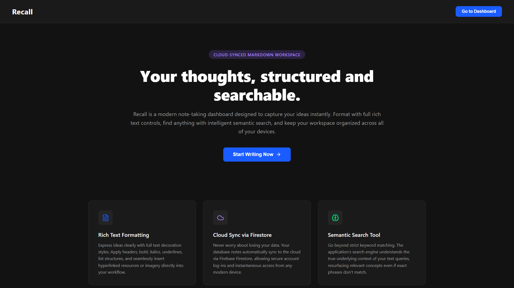

# 🧠 Recall

A full-stack personal knowledge management application featuring GPU-accelerated semantic search and Firestore vector search.

---

## 📺 Screenshots

| | | | |
| :----: | :---: | :---: | :---: |
|  |  |  |  |

| | |
| :---: | :---: |
|  |  |
|  |  |
---

## 📋 Table of Contents
- [🔍 Overview](#-overview)
- [✨ Key Features](#-key-features)
- [🛠️ Tech Stack](#️-tech-stack)
- [🏗️ Architecture Overview](#️-architecture-overview)
- [🔍 Semantic Search](#-semantic-search)
- [🧵 Embedding Pipeline](#-embedding-pipeline)
- [📊 Data Model](#-data-model)
- [🔒 Authentication & Security](#-authentication--security)
- [🚀 Performance](#-performance)
- [⚙️ Installation](#️-installation)
- [💼 Usage](#-usage)
- [🤝 Contributing](#-contributing)
- [📄 License](#-license)

---

## 🔍 Overview

**Recall** is a full-stack personal knowledge base optimized for storing, organizing, and deeply exploring personal notes. 

Unlike traditional keyword-based matching, Recall translates the underlying context of your content using sentence embeddings and Firestore Vector Search to retrieve exact records based on their core **semantic meaning**.

---

## ✨ Key Features

### 🎨 Frontend Experience
* **Rich-Text Editor:** Interactive editing engine powered by TipTap.
* **Smart Folders:** Dynamic workflows for pinning, archiving, trashing, and restoring notes.
* **Flexible Taxonomy:** Tagging and custom categories for quick groupings.
* **Responsive Layout:** Fluid dark/light adaptive interfaces across mobile and desktop.

### 🧠 Semantic & Vector Search
* **Contextual Retrieval:** Pure semantic search driven by machine learning vector embeddings.
* **Isolated Sandbox:** Secure multi-user data isolation keeping user records distinct.
* **GPU Pipeline:** Asynchronous embedding generation utilizing multiple processing workers.
* **Traffic Throttling:** Smart backend embedding debounce and strict job deduplication.

---
## 🛠️ Tech Stack

### 🎨 Frontend
* **Core:** React
* **Language:** JavaScript
* **State Management:** Zustand
* **Text Engine:** TipTap
* **Services Integration:** Firebase SDK
* **Styling:** CSS

### 🐍 Backend
* **API Framework:** FastAPI
* **ASGI Server:** Uvicorn
* **Environment Variables:** python-dotenv
* **Firebase Admin:** firebase-admin
* **ML Inference Library:** SentenceTransformers
* **Deep Learning Runtime:** PyTorch
* **Hardware Compute Platform:** CUDA

### ☁️ Database & Infrastructure
* **Identity Protocol:** Firebase Authentication
* **NoSQL Catalog:** Cloud Firestore
* **Search Engine:** Firestore Vector Search

---

## 🏗️ Architecture Overview

The platform uses a decoupled, three-layer blueprint, consisting of a React frontend, Firebase infrastructure, and a Python AI backend.

<p align="center">
  
  
</p>

### 📱 1. Frontend (React)
Manages localized state, event handling, and layout rendering.
* **Authentication:** Handles user sign-in and session state.
* **Note Management:** Standard CRUD operations, editing, and viewing.
* **Organization:** Category management for grouping notes.
* **Search Interface:** Triggers and displays semantic search requests.
* **UX/UI:** Fluid, responsive design with local UI state management.

### 🔥 2. Infrastructure & Auth (Firebase)
Serves as the secure global data catalog and security gate.
* **Authentication:** Manages secure user accounts.
* **Firestore Database:** Handles document persistence for notes.
* **Vector Search:** Performs scalable vector querying via Firestore.
* **Data Isolation:** Secures user-scoped notes and embedding data.

### 🐍 3. Backend API (Python)
Acts as the central machine learning broker and state synchronization worker.
* **Token Verification:** Unpacks and cryptographically checks incoming Firebase ID tokens.
* **Traffic Control:** Schedules incoming search requests to prevent pipeline choking.
* **AI Pipeline:** Generates query embeddings via machine learning models.
* **Vector Operations:** Executes vector searches and filters results.
* **Sync Engine:** Handles background synchronisation of note embeddings.

---

## 🔍 Semantic Search

Semantic search works by converting both notes and search queries into high-dimensional vector embeddings. This allows the system to match content based on conceptual meaning rather than exact keyword matches.

### 🔄 Search Pipeline

```text
[ User Query ]
       │
       ▼
[ React Frontend ]
       │  (Debounced)
       ▼
[ FastAPI ]
       │
       ▼
[ Firebase ID Token Verification ]
       │
       ▼
[ Thread-Safe Search Queue ]
       │
       ▼
[ Search Worker ]
       │
       ▼
[ Query Embedding ]
       │
       ▼
[ Sentence Transformer ]
       │
       ▼
[ Firestore Vector Search ]
       │
       ▼
[ Filtering ]
       │
       ▼
[ Matching Notes ]
       │
       ▼
[ React Frontend ]
```

### 🛠️ Core Capabilities

* **User Isolation:** Restricts cross-user notes search with verified UID.
* **Taxonomy Filters:** Supports granular category filtering.
* **State Scoping:** Filters results across active, archived, or trashed states.
* **Distance Thresholds:** Employs Cosine-distance thresholding to ensure relevance.
* **Concurrency Guard:** Manages multiple concurrent users through a thread-safe request queue.

---

## 🧵 Embedding Pipeline

Embedding generation is performed asynchronously so that note updates do not block the frontend application.

```text
       [ Firestore Change ]
                │
                ▼
      [ Firestore Listener ]
                │
                ▼
 [ 3-second Embedding Debounce ]
                │
                ▼
      [ Job Deduplication ]
                │
                ▼
   [ Min-Heap Priority Queue ]
                │
         ┌──────┴──────┐
         ▼             ▼
    [ Worker 1 ]  [ Worker 2 ]
         │             │
         └──────┬──────┘
                ▼
     [ Sentence Transformer ]
                │
                ▼
            [ CUDA ]
                │
                ▼
      [ Embedding Vector ]
                │
                ▼
   [ Firestore Vector Index ]
```

### ⏱️ Backend Debouncing & Deduplication

The note content in database needs to be updated much quicker than embeddings need to be calculated, to save our computer resources while also preventing data loss for user. Thus, the backend engine implements a structural safety layer:

* **Cooldown Period:** The backend therefore applies an additional cooldown before processing an embedding job.
* **Job Deduplication:** If multiple updates arrive during this period, obsolete jobs are deduplicated.
* **Efficiency First:** This deduplication ensures that embedding computation is primarily performed for the latest version of the note.

---

## 📊 Data Model

### 📝 Notes
`notes/{noteId}`
```json
{
    "ownerId": "...",
    "collaborators": [],

    "title": "...",
    "content": { /*...TipTap JSON...*/ },
    "preview": "...",
    "categoryName": "...",
    "categoryId": "...",

    "pinned": false,
    "archived": false,
    "deleted": false,

    "created": serverTimestamp(),
    "updated": serverTimestamp(),
    "textLastUpdated": serverTimestamp(),
}
```

### 🧠 Note Embeddings
`noteEmbeddings/{noteId}`
```json
{
    "ownerId": "...",
    "categoryId": "...",
    "archived": false,
    "deleted": false,
    "embedding": Vector(), //384 dim
    "textLastUpdated": serverTimestamp(),
}
```

### 👤 Users
`users/{userId}`
```json
{
    "email": "example@mail.com",
    "displayName": "...",
    "categories": [
        {//Permanent
            "name": "General",
            "id": "x",
            "created": serverTimestamp(),
        },
        //User created ones
    ],
}
```

### 💡 Design Considerations

* **Separation of Concerns:** Embedding documents intentionally do not contain the complete note content because the frontend does not need embedding data when retrieving notes.
* **Shared Identifiers:** The note and corresponding embedding use the same document ID, eliminating the need for a redundant `noteId` field.
---
## 🔒 Authentication & Security

The frontend authenticates users using Firebase Authentication. Search requests send a Firebase ID token to the FastAPI backend.

```text
   [ React ]
       │
       ▼
[ Firebase ID Token ]
       │
       ▼
   [ FastAPI ]
       │
       ▼
 [ Verify Token ]
       │
       ▼
 [ Trusted UID ]
       │
       ▼
 [ Search Queue ]
       │
       ▼
[ User-scoped Vector Search ]
```

### 🛡️ Multi-Tenant Isolation

* **Token-Derived Identity:** The backend does not trust a user-provided UID for tenant isolation.
* **Cryptographic Verification:** The UID used for search filtering is obtained strictly from the verified Firebase token.

---

## 🚀 Performance

Local embedding throughput bench-marked against text records:

* **Model Framework:** `all-MiniLM-L6-v2` via SentenceTransformers & PyTorch
* **Hardware Engine:** NVIDIA RTX 2050 (2048 CUDA Cores, Acceleration Enabled)

| Compute Configuration | Processing Throughput |
| :--- | ---: |
| Individual inference execution | ~50–70 notes/sec |
| Vector batch mode streaming | ~700 notes/sec |

> *Note: Metrics reflect local configurations and fluctuate based on token sequence size and hardware constraints.*

---

## ⚙️ Installation

### Setup Environment
```bash
# Clone the repository
git clone https://github.com

# Jump into project directory
cd recall
```

### Install Modules
```bash
# Setup Client UI Dependencies
npm install

# Setup Engine Dependencies
pip install -r requirements.txt
```

---

## 💼 Usage

### Spin Up Client Workspace
```bash
npm start
```

### Launch Python Compute Engine
```bash
python main.py
```

---

## 🤝 Contributing

Contributions are welcome! Please open an issue or submit a pull request for any changes.

---

## 📄 License

This project is licensed under the MIT License - see the [LICENSE](LICENSE) file for details.
