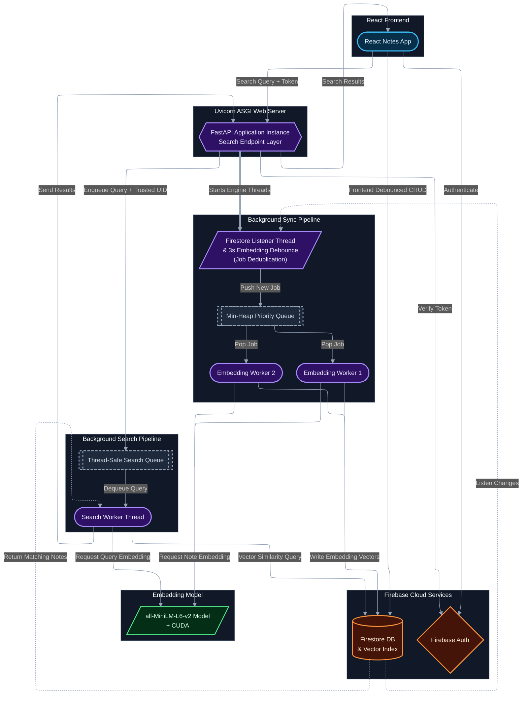

```mermaid
---
config:
  flowchart:
    defaultRenderer: elk
    htmlLabels: true
    padding: 20
  theme: dark
  themeVariables:
    fontSize: 13px
    labelPadding: 15px
    background: "#0b1120"
    primaryTextColor: "#e2e8f0"
    lineColor: "#94a3b8"
    clusterBkg: "#111827"
    clusterBorder: "#334155"
---
flowchart TB
    subgraph Client_Layer["React Frontend"]
        App(["React Notes App"])
    end

    subgraph Firebase_Layer["Firebase Cloud Services"]
        Auth{"Firebase Auth"}
        Firestore[("Firestore DB <br> &amp; Vector Index")]
    end

    subgraph Runtime_Server["Uvicorn ASGI Web Server"]
        API{{"FastAPI Application Instance<br>Search Endpoint Layer"}}
    end

    subgraph Sync_Engine["Background Sync Pipeline"]
        Listener[/"Firestore Listener Thread<br>&amp; 3s Embedding Debounce<br>(Job Deduplication)"/]
        PQueue[["Min-Heap Priority Queue"]]
        Worker1(["Embedding Worker 1"])
        Worker2(["Embedding Worker 2"])
    end

    subgraph Search_Engine["Background Search Pipeline"]
        SQueue[["Thread-Safe Search Queue"]]
        SearchWorker(["Search Worker Thread"])
    end

    subgraph Compute_Services["Embedding Model"]
        ModelService[/"all-MiniLM-L6-v2 Model<br>+ CUDA"/]
    end

    API == Starts Engine Threads ==> Listener
    App -- Authenticate --> Auth
    App -- Frontend Debounced CRUD --> Firestore
    Firestore -. Listen Changes .-> Listener
    Listener -- Push New Job --> PQueue
    PQueue -- Pop Job --> Worker1 & Worker2

    %% Seamless Line Merging Layout
    Worker1 --- J1
    Worker2 --- J1
    J1 -- Request Note Embedding --> ModelService

    Worker1 --- J2
    Worker2 --- J2
    J2 -- Write Embedding Vectors --> Firestore

    App -- Search Query + Token --> API
    API -- Verify Token --> Auth
    API -- Enqueue Query + Trusted UID --> SQueue
    SQueue -- Dequeue Query --> SearchWorker
    SearchWorker -- Request Query Embedding --> ModelService
    SearchWorker -- Vector Similarity Query --> Firestore
    Firestore -. Return Matching Notes .-> SearchWorker
    SearchWorker -- Send Results --> API
    API -- Search Results --> App

    App:::client
    Auth:::firebase
    Firestore:::firebase
    API:::backend
    Listener:::backend
    PQueue:::queue
    Worker1:::backend
    Worker2:::backend
    SQueue:::queue
    SearchWorker:::backend
    ModelService:::service
    RightRail:::hiddenAnchor

    %% Declared as pure empty containers to wipe out the junction circles
    J1[" "]:::invisibleMerge
    J2[" "]:::invisibleMerge

    classDef default fill:#111827,stroke:#334155,color:#e2e8f0
    classDef client fill:#082f49,stroke:#38bdf8,stroke-width:2px,color:#e0f2fe
    classDef firebase fill:#431407,stroke:#fb923c,stroke-width:2px,color:#ffedd5
    classDef backend fill:#2e1065,stroke:#a78bfa,stroke-width:2px,color:#ede9fe
    classDef queue fill:#1e293b,stroke:#94a3b8,stroke-width:2px,stroke-dasharray:4 4,color:#cbd5e1
    classDef service fill:#052e16,stroke:#4ade80,stroke-width:2px,color:#dcfce7
    classDef hiddenAnchor fill:none,stroke:none,color:#00000000

    %% Strict Zero-Asset Configuration to force a single shared orthogonal line trace
    classDef invisibleMerge display:none,visibility:hidden,opacity:0,fill:none,stroke:none,stroke-width:0px,width:0px,height:0px,padding:0px,margin:0px;

```