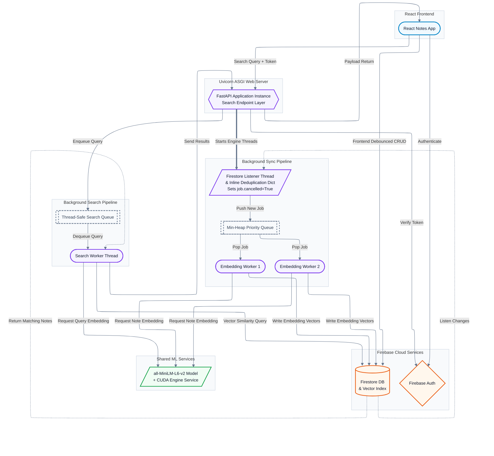

# Notes App Architecture

```mermaid
---
config:
  flowchart:
    defaultRenderer: elk
    htmlLabels: true
    padding: 20
  themeVariables:
    fontSize: 13px
    labelPadding: 15px
    background: "#ffffff"
    primaryTextColor: "#0f172a"
    lineColor: "#64748b"
    clusterBkg: "#f8fafc"
    clusterBorder: "#cbd5e1"
---
flowchart TB
 subgraph Client_Layer["React Frontend"]
        App(["React Notes App"])
 end
 subgraph Firebase_Layer["Firebase Cloud Services"]
        Auth{"Firebase Auth"}
        Firestore[("Firestore DB <br> &amp; Vector Index")]
 end
 subgraph Runtime_Server["Uvicorn ASGI Web Server"]
        API{{"FastAPI Application Instance<br>Search Endpoint Layer"}}
 end
 subgraph Sync_Engine["Background Sync Pipeline"]
        Listener[/"Firestore Listener Thread<br>&amp; Inline Deduplication Dict<br>Sets job.cancelled=True"/]
        PQueue[["Min-Heap Priority Queue"]]
        Worker1(["Embedding Worker 1"])
        Worker2(["Embedding Worker 2"])
 end
 subgraph Search_Engine["Background Search Pipeline"]
        SQueue[["Thread-Safe Search Queue"]]
        SearchWorker(["Search Worker Thread"])
 end
 subgraph Compute_Services["Shared ML Services"]
        ModelService[/"all-MiniLM-L6-v2 Model<br>+ CUDA Engine Service"/]
 end

    Client_Layer ~~~ RightRail[" "]
    Runtime_Server ~~~ RightRail
    Search_Engine ~~~ RightRail
    Compute_Services ~~~ RightRail

    API == Starts Engine Threads ==> Listener
    App -- Authenticate --> Auth
    App -- Frontend Debounced CRUD --> Firestore
    Firestore -. Listen Changes .-> Listener
    Listener -- Push New Job --> PQueue
    PQueue -- Pop Job --> Worker1 & Worker2
    Worker1 -- Request Note Embedding --> ModelService
    Worker2 -- Request Note Embedding --> ModelService
    Worker1 -- Write Embedding Vectors --> Firestore
    Worker2 -- Write Embedding Vectors --> Firestore
    App -- Search Query + Token --> API
    API -- Verify Token --> Auth
    API -- Enqueue Query --> SQueue
    SQueue -- Dequeue Query --> SearchWorker
    SearchWorker -- Request Query Embedding --> ModelService
    SearchWorker -- Vector Similarity Query --> Firestore
    Firestore -. Return Matching Notes .-> SearchWorker
    SearchWorker -- Send Results --> API
    API -- Payload Return --> App

    App:::client
    Auth:::firebase
    Firestore:::firebase
    API:::backend
    Listener:::backend
    PQueue:::queue
    Worker1:::backend
    Worker2:::backend
    SQueue:::queue
    SearchWorker:::backend
    ModelService:::service
    RightRail:::hiddenAnchor

    classDef default fill:#ffffff,stroke:#cbd5e1,color:#0f172a
    classDef client fill:#f0f9ff,stroke:#0284c7,stroke-width:2px,color:#0f172a
    classDef firebase fill:#fff7ed,stroke:#ea580c,stroke-width:2px,color:#0f172a
    classDef backend fill:#f5f3ff,stroke:#7c3aed,stroke-width:2px,color:#0f172a
    classDef queue fill:#f8fafc,stroke:#64748b,stroke-width:2px,stroke-dasharray:4 4,color:#334155
    classDef service fill:#f0fdf4,stroke:#16a34a,stroke-width:2px,color:#0f172a
    classDef hiddenAnchor fill:none,stroke:none,color:#00000000

```
