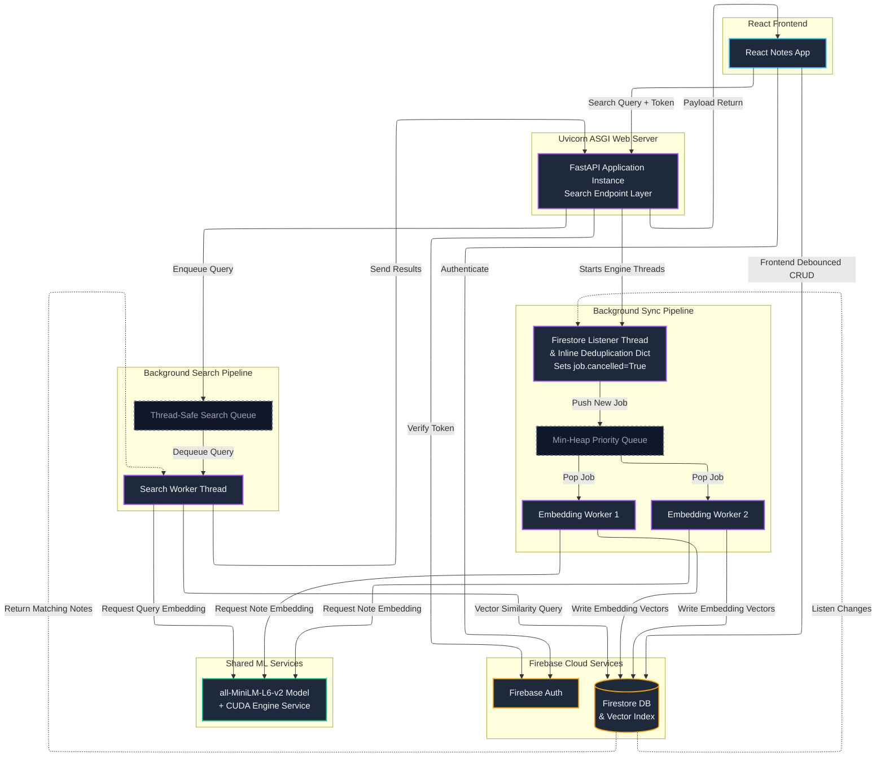

# Notes App Architecture

```mermaid
%%{init: {'flowchart': {'defaultRenderer': 'elk'}}}%%
graph TD
    %% VS Code Theme-Agnostic High-Contrast Styling with Background Overrides
    classDef default fill:#0f172a,stroke:#334155,color:#f8fafc;
    classDef client fill:#1e293b,stroke:#38bdf8,stroke-width:2px,color:#f3f4f6;
    classDef firebase fill:#1e293b,stroke:#f59e0b,stroke-width:2px,color:#f3f4f6;
    classDef backend fill:#1e293b,stroke:#a855f7,stroke-width:2px,color:#f3f4f6;
    classDef queue fill:#0f172a,stroke:#64748b,stroke-width:2px,stroke-dasharray: 4 4,color:#9ca3af;
    classDef service fill:#1e293b,stroke:#10b981,stroke-width:2px,color:#f3f4f6;

    %% Client Layer
    subgraph Client_Layer [React Frontend]
        App[React Notes App]
    end
    class App client;

    %% Firebase Layer
    subgraph Firebase_Layer [Firebase Cloud Services]
        Auth[Firebase Auth]
        Firestore[(Firestore DB <br> & Vector Index)]
    end
    class Auth,Firestore firebase;

    %% Application Server Infrastructure
    subgraph Runtime_Server [Uvicorn ASGI Web Server]
        API[FastAPI Application Instance<br>Search Endpoint Layer]
    end
    class API backend;

    %% Background Compute Engines (Decoupled from FastAPI runtime routes)
    subgraph Sync_Engine [Background Sync Pipeline]
        Listener[Firestore Listener Thread<br>& Inline Deduplication Dict<br>Sets job.cancelled=True]
        PQueue[Min-Heap Priority Queue]
        Worker1[Embedding Worker 1]
        Worker2[Embedding Worker 2]
    end
    class Listener,Worker1,Worker2 backend;
    class PQueue queue;

    subgraph Search_Engine [Background Search Pipeline]
        SQueue[Thread-Safe Search Queue]
        SearchWorker[Search Worker Thread]
    end
    class SearchWorker backend;
    class SQueue queue;

    %% Centralized Shared ML Engine Component
    subgraph Compute_Services [Shared ML Services]
        ModelService[all-MiniLM-L6-v2 Model<br>+ CUDA Engine Service]
    end
    class ModelService service;

    %% System Init Flow
    API -->|"Starts Engine Threads"| Listener

    %% Client Interactions
    App -->|"Authenticate"| Auth
    App -->|"Frontend Debounced CRUD"| Firestore

    %% Real-time Sync Data Pipeline
    Firestore -.->|"Listen Changes"| Listener
    Listener -->|"Push New Job"| PQueue
    PQueue -->|"Pop Job"| Worker1
    PQueue -->|"Pop Job"| Worker2

    %% Sync Pipeline using Shared Model Engine
    Worker1 -->|"Request Note Embedding"| ModelService
    Worker2 -->|"Request Note Embedding"| ModelService
    Worker1 -->|"Write Embedding Vectors"| Firestore
    Worker2 -->|"Write Embedding Vectors"| Firestore

    %% Semantic Search Request Pipeline
    App -->|"Search Query + Token"| API
    API -->|"Verify Token"| Auth
    API -->|"Enqueue Query"| SQueue
    SQueue -->|"Dequeue Query"| SearchWorker

    %% Search Pipeline using Shared Model Engine
    SearchWorker -->|"Request Query Embedding"| ModelService
    SearchWorker -->|"Vector Similarity Query"| Firestore
    Firestore -.->|"Return Matching Notes"| SearchWorker
    SearchWorker -->|"Send Results"| API
    API -->|"Payload Return"| App
```
